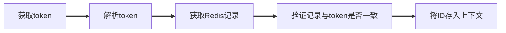
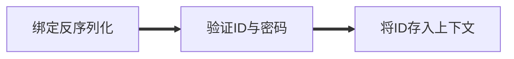

> **请克隆至 GOPATH/src/NetworkDisk** 目录下并启用 **GO111MODULE**

# NetworkDisk

## PKG

| 包名        | 作用              | 详情                         |
| ----------- | ----------------- | ---------------------------- |
| config      | 处理部分配置信息  | 历史遗留                     |
| Database    | 负责MySQL相关操作 | 历史遗留                     |
| Handlers    | 路由处理          | 登录，注册，注销，上传，下载 |
| Middlewares | 中间件            | 信息验证，令牌验证           |
| Models      | 模型              | JWT，Redis，User             |
| Routers     | 路由设置          | ….                           |


### config

> json序列化

```go
func Init(ConfPath string) (result Conf)
```

> 目前只负责MySQL配置

```go
type Sql struct {
	SqlName string		//数据库名
	SqlUserName string	//数据库登录用账户名
	SqlUserPwd string	//数据库登录用账户密码
	SqlAddr string		//数据库地址
}

type Conf struct {
	Sql
	Addr string	//服务器地址
}
```


```json
{
  "SqlName":"networkdisk",
  "SqlUserName": "root",
  "SqlUserPwd": "root",
  "SqlAddr":"127.0.0.1:3306",
  "Addr":"localhost:8080"
}
```

### Database

```go
func InitGorm(sql *config.Sql) *gorm.DB 
```

### Handlers

| 定义                                                         | 详情          |
| :----------------------------------------------------------- | ------------- |
| func Download() gin.HandlerFunc                              | 文件下载      |
| funcs(封装了一些常用的功能)                                  | 从JWT中获得ID |
| func Login(redis redis.RedisPool,template jwt.Jwt) gin.HandlerFunc | 登录          |
| func Logout(pool redis.RedisPool) gin.HandlerFunc            | 注销          |
| func Register(db *gorm.DB) gin.HandlerFunc                   | 注册          |
| func Upload() gin.HandlerFunc                                | 上传文件      |

### Middleware

| 定义                                                         | 详情                 |
| ------------------------------------------------------------ | -------------------- |
| func CheakJWT(pool redis.RedisPool,template jwt.Jwt) gin.HandlerFunc | 验证令牌正确性       |
| func CheakUserInfo(db *gorm.DB) gin.HandlerFunc              | 验证用户信息的正确性 |


#### CheakJWT



#### CheakUserInfo



### Models

| 名字  | 详情          |
| ----- | ------------- |
| JWT   | JWT相关定义   |
| Redis | Redis相关定义 |
| User  | User相关定义  |

#### JWT

```go
type Header struct {
	Alg string `json:"alg"`
	Typ string `json:"typ"`
}

type Payload struct {
	Iss string 	`json:"iss"`
	Exp uint 	`json:"exp"`
	Sub string 	`json:"sub"`
	Aud int 	`json:"aud"` //用户ID
	Ndf uint 	`json:"ndf"`
	Iat uint 	`json:"iat"`
	Jti uint 	`json:"jti"`
}

type Jwt struct{
	Header Header
	Payload Payload
	Secret string
}
```

| 方法                                    | 作用                             |
| --------------------------------------- | -------------------------------- |
| func (j Jwt)Encoding() string           | 基于当前的Header与Payload计算JWT |
| func (j *Jwt)Decoding(jwt string) error | 基于jwt刷新Payload的值           |

#### RedisPool

```go
type RedisPool struct {
	Read 		string
	Write 		string
	IdLeTimeout	int
	MaxIdle		int
	MaxActive	int
	rpool *redis.Pool
	wpool *redis.Pool
}
```

| 方法                                             | 详情         |
| ------------------------------------------------ | ------------ |
| func (r *RedisPool)Init()                        | 初始化连接池 |
| func (r RedisPool)SET(args ...interface{}) error | 执行set指令  |
| func (r RedisPool)GET(key string) (string,error) | 执行get指令  |
| func (r RedisPool)DEL(key string) error          | 执行del指令  |

#### User

```go
type User struct {
	Uid int `gorm:"primaryKey"`
	Name string	`gorm:"string not null"`//用户名
	Pwd string `gorm:"string not null"`//用户密码
}
```

| 方法                                                | 详情                                  |
| :-------------------------------------------------- | ------------------------------------- |
| func (u *User)Save(db *gorm.DB) (err error)         | 在数据库中创建用户                    |
| func (u *User)Load(db *gorm.DB,uid int) (err error) | 根据提供的UID读取用户信息             |
| func (u *User)PwdIsRight(db *gorm.DB) bool          | 判断密码是否正确，如果不正确返回false |
| func (u *User)IsExist(db *gorm.DB) bool             | 判断是否存在，如果不存在返回false     |

### Routers

```go
group:=server.Group("/", Middlewares.CheakJWT(pool,template))
{
	group.POST("/logout", Handlers.Logout(pool))
	group.POST("/upload", Handlers.Upload())
	group.GET("/download", Handlers.Download())
}
server.POST("/register", Handlers.Register(db))
server.POST("/login", Middlewares.CheakUserInfo(db),Handlers.Login(pool,template))
```


